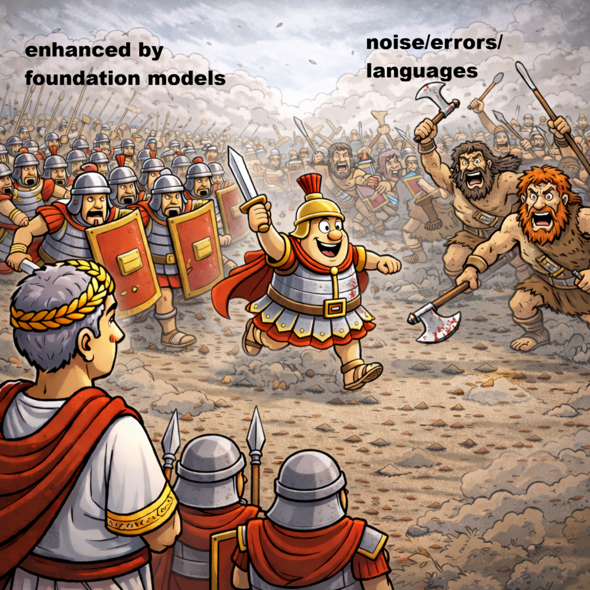

# 

# Centurion (foundation model plugin for Julius decoder, no source‑code patching on Julius’ side.)

> **Centurion** is a lightweight plug-in that lets the classic **[Julius](https://github.com/julius-speech/julius)** decoder support speech‑foundation models—**wav2vec 2.0, WavLM, HuBERT, Whisper**, and more.  Keep Julius’ blazing‑fast decoding (no Kaldi wfst building required), adding the acoustic power of large self‑supervised encoders.

please check following link for more details:
https://halspeech.github.io/Centurion.html

---

## ✨ Key Features

| Feature | Description |
|---------|-------------|
| **Model Support** | Built‑in presets for wav2vec 2.0 (base/large), WavLM (base/large), HuBERT (base/large/xl), and Whisper (large‑v3). |
| **Streaming & offline** | Works with Julius’ *vecnet* real‑time protocol **and** batch HTK logit dumping. |
| **GPU / CPU** | both supported |

---

## 🚀 Quick Start

```bash
# 1️⃣  Install 
conda env create -f environment.yml
# To activate this environment, use
conda activate foundation_features
# To deactivate an active environment, use
conda deactivate

# compile julius-4.4.2 with following configurations (--enable-words-int --enable-sp-segment)
The pre-compiled binary for both Linux and Windows (Cygwin) is uploaded to the bin dir
Of course, you can compile for your own environment.

# 2️⃣  Download a model from https://huggingface.co/shenglisten/models
# (We need to make some changes to the model, making the model work frame-by-frame)
# 
wav2vec 2.0, and Whisper (large‑v3) models have well-tuned recipes
WavLM, HuBERT, and Data2Vec recipes will be uploaded later 
All of the above models are used as Centurion feature-extracting models,
and they have corresponding Julius decoding models
https://huggingface.co/shenglisten/models
We prepared pre-extracted features for user testings
https://huggingface.co/shenglisten/datasets


# 3️⃣  Launch the Centurion in two ways: online or offline
Both follow Julius's way

# 4️⃣  Fire up Julius
julius -C main.jconf 
```
You should see something like:

```
[INFO] Model loaded (output dimension = ****)
[INFO] Julius connected from 127.0.0.1:5531
[INFO] Ready. Listening for speech...
```
You can find the models from the following, and list is still updating:
1. Centurion feature extracting model (Centurion model), 
2. Julius decoding model (Julius model))
```
for the Chinese language:
Centurion feature extracting model:
https://huggingface.co/shenglisten/Centurion_whisper_cn
https://huggingface.co/shenglisten/Centurion_wav2vec2_cn
Julius decoding model:
https://huggingface.co/shenglisten/model_julius4whisper_cn
https://huggingface.co/shenglisten/model_julius4wav2vec2_cn

for the Japanese language:
Centurion feature extracting model:
https://huggingface.co/shenglisten/Centurion_wav2vec2_ja
Julius decoding model:
https://huggingface.co/shenglisten/model_julius4whisper_ja (CSJ LM model)
https://huggingface.co/shenglisten/model_julius4whisper_ja (NVIDIA LM model)

for the English language:
Centurion feature extracting model:
https://huggingface.co/shenglisten/Centurion_wavlm-libri-clean-100h-large_en
https://huggingface.co/shenglisten/Centurion_wav2vec2-xls-r-1b_en
https://huggingface.co/shenglisten/Centurion_wav2vec2-large-xlsr-53_en
https://huggingface.co/shenglisten/Centurion_hubert-xlarge-ls960-ft_en
https://huggingface.co/shenglisten/Centurion_data2vec-audio-base-960h_en
Julius decoding model:
https://huggingface.co/shenglisten/model_julius4wavlm_en
https://huggingface.co/shenglisten/model_julius4w2v-xlr.nvlm_en (NVIDIA LM model)
https://huggingface.co/shenglisten/model_julius4w2v_en
https://huggingface.co/shenglisten/model_julius4hubert_en
https://huggingface.co/shenglisten/model_julius4hubert.nvlm_en (NVIDIA LM model)
https://huggingface.co/shenglisten/model_julius4d2v-base_en

```

---

## 🏗️ Pipeline

```
online mode:
Audio → adintool → Centurion (load foundation model) → vecnet (frame‑level log‑probs or logits matching the phone/state lists) → Julius decoding → Final hypothesis

offline mode:
Audio → Centurion (load foundation model) → generate features (frame‑level log‑probs or logits in HTK format) → Julius decoding → Final hypothesis
```
No source‑code patching on Julius’ side.
---

---

## 🤝 Contributing
Pull requests are welcome!  Please open an issue to discuss. Or ask by email: sheng.li@ieee.org

## 📜 License

Centurion is released under the MIT License – see [LICENSE](LICENSE) for details.
for Julius-related program or models, please follow Julius licence (also copied in this project)
本ソフトウェアは「大語彙連続音声認識エンジン Julius」を外部から呼び出しています。 「Juliusディクテーションキット」のライセンスに従い、LICENSE.dictation-kitを同梱しています。


## 🏛️ Citation

If you use Centurion in academic work, please cite:

```bibtex
@software{centurion2025,
  author       = {Sheng Li},
  title        = {Centurion: foundation model plugin for Julius decoder},
  year         = 2025,
  url          = {https://github.com/halspeech/julius-speech-foundation-model},
  note         = {Version 0.1.0}
}
```

---

## 💬 Acknowledgements
* Julius speech decoder – Nagoya Institute of Technology and Kyoto University

本ソフトウェアは「大語彙連続音声認識エンジン Julius」を外部から呼び出しています。
「Juliusディクテーションキット」のライセンスに従い、LICENSE.dictation-kitを同梱しています。
  
* wav2vec 2.0, HuBERT, WavLM – Facebook AI, Microsoft Research
* Whisper – OpenAI

---

🏛️  With Centurion and troops reinforced by speech foundation models, 
your old friend Julius conquers the new frontiers of noise/errors/languages.
# 
